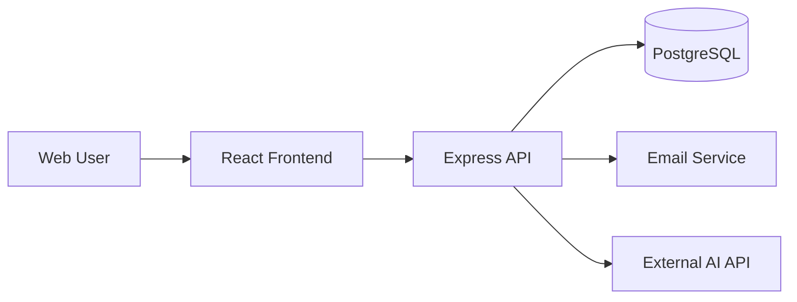

# PortNova Architecture

## Overview
PortNova is organized around three core functions:

1. Youth services for profile management and career support.
2. Employer services for posting jobs and reviewing applicants.
3. Learning and CV support services for courses and resume assistance.

## Technology Stack
- Backend: Node.js, Express, PostgreSQL
- Frontend: React, React Router, Material UI
- Security and validation: Helmet, CORS, rate limiting, Joi
- Utilities: JWT, bcrypt, multer, nodemailer, axios

## High-Level Architecture

## Database Schema
- `users`: authentication and identity data.
- `youth_profiles`: youth-specific profile details linked to users.
- `companies`: employer organization records.
- `jobs`: job listings posted by companies.
- `courses`: training and learning content.
- `cv_requests`: CV support requests from users.
- `job_applications`: application records connecting users and jobs.

## API Design Principles
- Keep routes resource-based and predictable.
- Validate all inputs before processing.
- Return consistent JSON responses.
- Separate route, controller, model, and utility concerns.
- Apply authentication and authorization only where needed.